

 

 
 
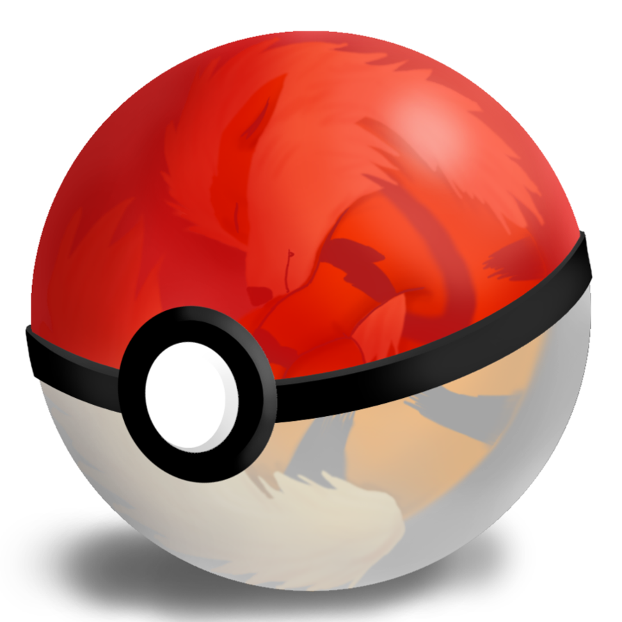 Indice

* [1. Presentación](#1-presentación)
* [2. Resumen del proyecto](#2-resumen-del-proyecto)
* [3. Planificación del proyecto](#3-planificación-del-proyecto)
* [4. Diseño UX](#4-diseño-ux)
  * [Investigación con jugadores de Pokemon Go](investigación-con-jugadores-de-Pokemon-Go)
  * [Expectativas y necesidades del usuario en base al juego](#Expectativas-y-necesidades-del-usuario-en-base-al-juego)
   * [Público Objetivo](#publico-objetivo)
   * [Test de Usabilidad](#Test-de-Usabilidad)
* [5. Diseño UI](#5-diseño-ui)
   * [Proceso del diseño](#proceso-del-diseño)
      * [Estilo](#estilo)
      * [Teoria del color](#teoria-del-color)
   * [Prototipo de baja fidelidad](#prototipo-de-baja-fidelidad)
   * [Prototipo de alta fidelidad](#prototipo-de-alta-fidelidad)
* [6. Diseño final](#6-diseño-final)
* [7. Objetivos de aprendizaje](#7-objetivos-de-aprendizaje)
   * [UX](#ux)
   * [UI](#ui)
   * [HTML](#html)
   * [CSS](#css)
   * [Web APIs](#web-apis)
   * [JAVASCRIPT](#javascript)
   * [CONTROL DE VERSIONES DE Git Y GitHub](#control-de-versiones-de-git-y-github)
* [8. Consideraciones generales](#8-consideraciones-generales)
* [9. Pruebas Unitarias 💯 ✅](#9-pruebas-unitarias-💯-✅)
* [10.Herramientas](#10-herramientas)
* [11. Checklist](#11-checklist)
***

## 1. Presentación
Pokemon Go Cards es una web creada para los fans y aficionados del juego original con el objetivo que puedan complementar y filtrar información sobre los pokemones de las dos primeras generaciones, y que el usuario pueda utilizar dichos datos según sus necesidades. La navegación dentro del sitio web es amigable, dinámica e intuitiva, y lograr que el usuario sienta comodidad al trasladarse de una interfaz a otra.

## 2. Resumen del proyecto
La WEB consta de 4 interfaces. La primera, es la imagen de presentación, al cargar la página se muestran tres imágenes, una detrás de otra con un efecto de transición, y que al hacer click en el ícono que se muestra al lado inferior derecho, dirige al usuario a la siguiente interfaz. La segunda, es el inicio de sesión donde el usuario deberá ingresar un username y un password determinado, ambos campos son obligatorios, en caso se equivoque saldrá un alert informándole que debe volver a intentarlo e ingresar los datos correctos(Username: Laboratoria // Password: Dev006), y al dar enter lo lleva a la siguiente interfaz. La tercera, consta de un saludo de bienvenida y luego de unos segundos cambiará la imagen y el mensaje, informándole lo que va a poder encontrar en la interfaz principal, para dirigirse a la última interfaz deberá hacer click en el ícono que se localiza en la parte inferior derecha. Y en la última, encontrará una barra de menú que le permitirá al usuario dirigirse a cualquier parte de la interfaz, ya que esta cuenta con botones que al hacer click lo redigirá a donde quiera ir. También, podrá ordenar según las opciones que se muestra en el sub-menú de order de manera alfabética y numérica de manera ascendente y descendente: A-Z, Z-A, NUMBER 🢁, NUMBER 🢃, o al hacer click en el botón filter, este hace un scroll hacia esta sección donde podrá filtar a los pokemones según su tipo, por su debilidad, fortaleza, incluso podrá ver al top10 y last10 en el filtro fuerza. Además, podrá buscar a todos los pokemones por su número o por su nombre, en caso no encuentre el nombre indicado al hacer click en la lupa, se motrará una ventana informando que ese pokemon no fue encontrado, y lo invitará a realizar otra búsqueda. Todo esto se podrá observar en la pantalla ya que se muestran todas las cards de los pokemones. Y en la parte final de esta misma página, encontrará el footer que cuenta con íconos de las redes sociales del juego original, que redirigen a las mismas, y el copyright de las creadoras. Esperamos que los nuevos y antiguos usuarios puedan mejorar sus estrategias de ataque con la información brindada en esta nueva propuesta de app y web.

## 3. Planificación del proyecto

Para la planificación de este proyecto usamos como herramienta de objetivos y tareas Trello.
https://trello.com/b/rbeLiEEG/pokemon-dl23
Además, de acompañamiento por parte de nuestros coaches de Laboratoria en Office Hours y actividades diarias dentro del bootcamp usando el daily, google calendary, slack y talleres de test-camp.

## 4. Diseño UX
### Investigación con jugadores de Pokemon Go
### HISTORIA DE USUARIO
### Expectativas y necesidades del usuario en base al juego
### Público Objetivo
### Test de Usabilidad
## 5. Diseño UI
### Proceso del diseño
#### Estilo
#### Teoria del color

### Prototipo de baja fidelidad
### Prototipo de alta fidelidad
## 6. Diseño final
### PC
#### PRIMERA INTERFAZ

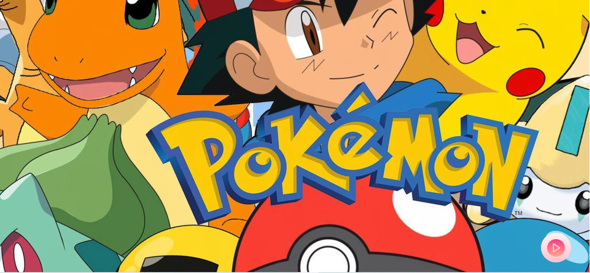
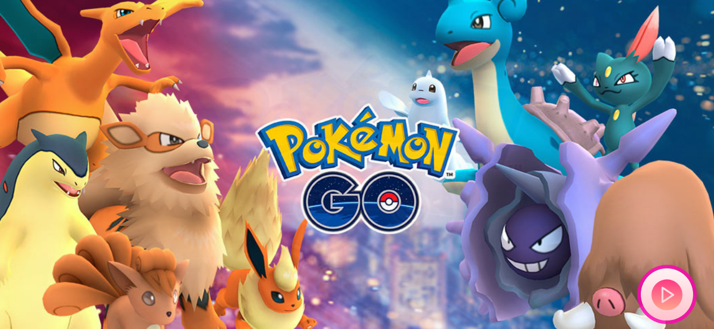
 
 

#### SEGUNDA INTERFAZ

 
 

#### TERCERA INTERFAZ

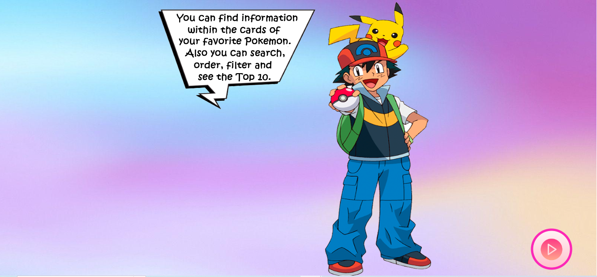
 
 

#### CUARTA INTERFAZ

 
 
 

### CELULAR
#### PRIMERA INTERFAZ (horizontal)

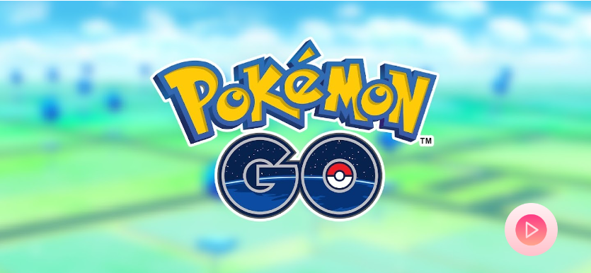
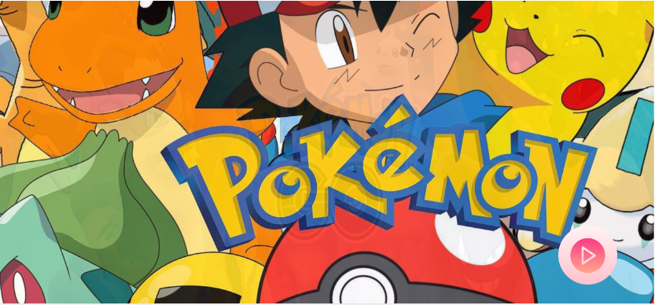
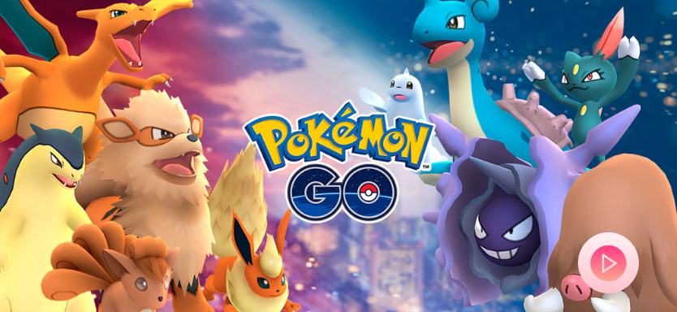
 
 

#### SEGUNDA INTERFAZ (vertical)

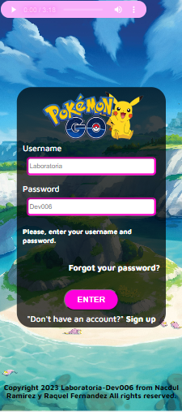
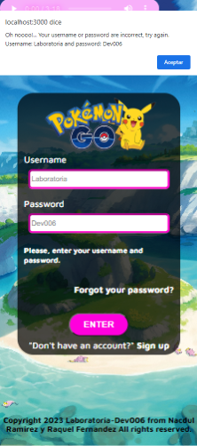

 
 

#### TERCERA INTERFAZ(vertical)

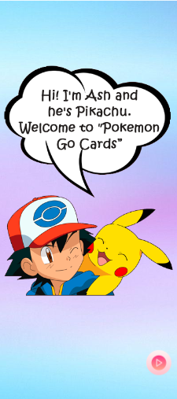

 
 

#### CUARTA INTERFAZ(vertical)

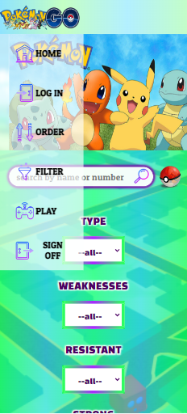

 
 
 

## 7. Objetivos de aprendizaje
 [ ✔️] **SÍ**     [ ❌]**NO**     [ 🟡] **REGULAR**

### UX

- [ ✔️] **Diseñar y desarrollar un producto o servicio poniendo al usuario en el centro**
- [ ✔️] **Crear protoripos de alta fidelidad que incluyan interacciones para recibir feedback en cada sprint por parte de los coaches y compañeras, e iterar.**
- [ ✔️] **Aplicar los principios de diseño visual(contraste, alineación, jerarquía, etc).**
- [ ✔️] **Planear y ejecutar test de usabilidad**

### UI

- [ ✔️] **Guiar al usuario en la navegación dentro de la aplicación (usamos alerts y modal con mensajes, y una interfaz para indicarle que es lo que encontrará en el app).**

### HTML

- [ ✔️] **Uso de HTML semántico**
- [ ✔️] **Construir la aplicación respetando el diseño de planificación(maquetación).**

### CSS

- [ ✔️] **Uso de selectores de CSS**
- [ ✔️] **Modelo de caja (box model): borde, margen, padding**
- [ ✔️] **Uso de flexbox en CSS**

### Web APIs

- [ ✔️] **Uso de selectores del DOM**
- [ ✔️] **Manejo de eventos del DOM (listeners)**
- [ ✔️] **Manipulación dinámica del DOM**

### JavaScript

- [ 🟡] **Diferenciar entre tipos de datos primitivos y no primitivos**
- [ ✔️] **Arrays (sort, filter, localeCompare, reverse, includes)**
- [ 🟡] **Objetos (key, value)**
- [ ✔️] **Variables (declaración, asignación, ámbito)**
- [ ✔️] **Uso de condicionales (if-else, lógica booleana)**
- [ 🟡] **Funciones (params, args, return)**
- [ ✔️] **Pruebas unitarias (unit tests)**
- [ ✔️] **Módulos de ECMAScript (ES Modules)**
- [ ✔️] **Uso de linter (ESLINT)**
- [ ✔️] **Uso de identificadores descriptivos (Nomenclatura y Semántica)**
- [ ❌] **Diferenciar entre expresiones (expressions) y sentencias (statements)**

### CONTROL DE VERSIONES DE Git Y GitHub

- [ ✔️] **Git: Instalación y configuración**
- [ ✔️] **Git: Control de versiones con git (init, clone, add, commit, status, push, pull, remote)**
- [ ❌] **Git: Integración de cambios entre ramas (branch, checkout, fetch, merge, reset, rebase, tag)**
- [ ✔️] **GitHub: Creación de cuenta y repos, configuración de llaves SSH**
- [ ✔️] **GitHub: Despliegue con GitHub Pages**
- [ ❌] **GitHub: Colaboración en Github (branches | forks | pull requests | code review | tags)**

## 8. Consideraciones generales

* Este proyecto se realizó en duplas.

 [Nacdul V. Ramirez Zavala](https://github.com/Dul31)  &
 [Raquel M. Fernandez Reategui](https://github.com/raquel-mali)
* La interfaz del proyecto está desplegada en GitHub Pages
* El tiempo de entrega del proyecto fue de 5 semanas.

## 9. Pruebas Unitarias 💯 ✅

Para realizar las pruebas unitarias se tuvo que crear `tests` para comprobar si la lógica del código está funcionando correctamente, y si valida el comportamiento de la data o detecta errores. Y si en el futuro queremos factorizar el código, los test deben seguir validando dichos cambios. Utilizamos el comando `npm test` para correr los test realizados en el código, y el resultado fue libre de errores y sobrepasó el 70% del mínimo requerido del proyecto.

## 10. Herramientas

* [Git](https://git-scm.com/)
* [GitHub](https://github.com/)
* [GitHub Pages](https://pages.github.com/)
* [Node.js](https://nodejs.org/)
* [HTML](https://desarrolloweb.com/home/html)
* [JavaScript](https://developer.mozilla.org/es/docs/Web/JavaScript)
* [CSS](https://developer.mozilla.org/es/docs/Web/CSS)
* [Figma](https://www.figma.com/)
* [Trello](https://trello.com/)
* [Photoshop](https://adobe-photoshop.softonic.com/)
* [Canva](https://www.canva.com/)

## 11. Checklist
[ ✔️] **SÍ**
[ ❌] **NO**
[ 🟡] **REGULAR**

* [ ✔️] Usa VanillaJS.
* [ ✔️] Pasa linter (`npm run pretest`)
* [ ✔️] Pasa tests (`npm test`)
* [ ✔️] Pruebas unitarias cubren un mínimo del 70% de statements, functions y
  lines y branches.
* [ ✔️] Incluye _Definición del producto_ clara e informativa en `README.md`.
* [ ✔️] Incluye historias de usuario en `README.md`.
* [ ✔️] Incluye _sketch_ de la solución (prototipo de baja fidelidad) en
  `README.md`.
* [ ✔️] Incluye _Diseño de la Interfaz de Usuario_ (prototipo de alta fidelidad)
  en `README.md`.
* [ ❌] Incluye link a Zeplin en `README.md`.
* [ ✔️] Incluye link a Figma en `README.md`.
* [ ✔️] Incluye el listado de problemas que detectaste a través de tests de
  usabilidad en el `README.md`.
* [ ✔️] UI: Muestra lista y/o tabla con datos y/o indicadores.
* [ ✔️] UI: Permite ordenar data por uno o más campos (asc y desc).
* [ ✔️] UI: Permite filtrar data en base a una condición.
* [ ✔️] UI: Es _responsive_.
